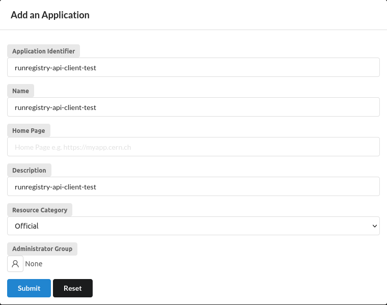
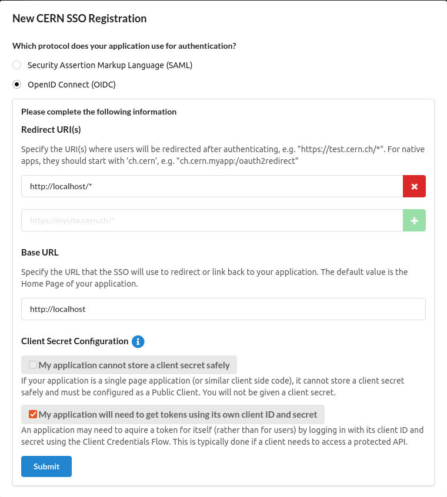

[](https://pypi.org/project/cernrequests/)


# CERN Requests


Enables using [`requests`]("https://github.com/requests/requests") without having to configure the CERN Root certificates or getting an API access token manually.

Inspired by [`certifi`](https://github.com/certifi/python-certifi), [`requests-kerberos`](https://github.com/requests/requests-kerberos), [`cern-sso-python`](https://github.com/cerndb/cern-sso-python) and [`api-access-examples`](https://gitlab.cern.ch/authzsvc/docs/api-access-examples/-/tree/master/python).

The Root certificate bundle is copied from the [linuxsoft cern page](http://linuxsoft.cern.ch/cern/centos/7/cern/x86_64/repoview/CERN-CA-certs.html) and can also be created manually by downloading the CERN Grid Certification Authority files from [cafiles.cern.ch/cafiles](https://cafiles.cern.ch/cafiles/).

## Installation

> **Warning**
> We are no longer supporting Python 2.7.

Requires Python 3.6+.

```bash
pip install cernrequests
```

## Prerequisites

### For sites requiring an SSL Grid certificate

Request a [Grid User Certificate](https://ca.cern.ch/ca/) (with password) and convert into public and private key:

```bash
mkdir -p ~/private
openssl pkcs12 -in myCertificate.p12 -clcerts -nokeys -out ~/private/usercert.pem  # Will ask for the certificate password
openssl pkcs12 -in myCertificate.p12 -nocerts -nodes -out ~/private/userkey.pem  # Will ask for the certificate password
```

The `.pem` certificates have to be **passwordless**.

### For CERN APIs using the ""new"" SSO

An `.env` file at the root of your project with the following variables set:
- `SSO_CLIENT_ID`
- `SSO_CLIENT_SECRET`

(You can rename the `.env_sample` file to `.env` and add the values there).

To request them, you will need to register your application:

1. Create an SSO registration for your application
    on the [CERN Application Portal](https://application-portal.web.cern.ch):

    

2. Add an application identifier and description:

    

    The `Application Identifier` can be anything, it's like a username for your application.t 
    
    Click `Submit`.

3. Go back to the Application Portal and edit the SSO application (green button). Then, go to the `SSO Registration` tab and click the plus button:

    

4. Fill out the form of the new SSO registration as follows:

    

    - You can put any value in the `Redirect URI(s)`, e.g. `http://localhost/*`
    - Same for the `Base URL`
    - Make sure you click `My application will need to get tokens using its own client ID and secret`.

5. Submit the form:

    

    Note the `client id` and `client secret` that the form will show you.

## Usage

### Example

#### With Grid Certificates
```python
import cernrequests

url = "https://<your-cern-website>"
response = cernrequests.get(url)
```

#### With API Token

If you want to access a website which requires a (""new"") CERN Single Sign-on token you can do the following:

```python
import cernrequests

url = "https://<your-cern-website-url>"
reponse = cernrequests.get_with_token(url, target_audience="<the SSO id of the target URL>")
```
> **Note**
> The `target_audience` depends on the SSO registration name of the _target_ application. E.g.
> if you want to access the development instance of Run Registry, `target_audience` should be 
> `dev-cmsrunregistry-sso-proxy`. 
> In case of doubt, communicate with the app's developers directly. 

The `get_with_token` method also accepts an `api_token` argument, in case you want to reuse an already issued and non-expired one that you got from [`get_api_token`](#get_api_token).

##### `get_api_token`

This is a method that needs a `target_application` parameter and will try and get an API token, using the `SSO_CLIENT_ID` and `SSO_CLIENT_SECRET` provided as environment variables. 

A `tuple` is returned: `api_token` (`str`) and the `expiration_datetime` (`datetime`).

> **Note**
> The `expiration_datetime` is not used internally, so it's returned
> to the user, if they need to check when the token expires. 
#### Alternative usage

If you want to use ```requests``` directly without the CERN wrapper you can get the exact same functionality by doing:

```python
import requests
from cernrequests import certs

url = "https://<your-cern-website>"
cert = certs.default_user_certificate_paths()
ca_bundle = certs.where()

response = requests.get(url, cert=cert, verify=ca_bundle)
```

## Configuration

### Grid certificates

The default user certificate paths are first ```~\private\``` and ```~\.globus\``` for fallback. The default *public* key file name is ```usercert.pem``` and the default *private* key file name is ```userkey.pem```

You can configure the default grid user certificate path by setting the ```CERN_CERTIFICATE_PATH``` environment variable.

For example:

```bash
export CERN_CERTIFICATE_PATH=${HOME}/my_custom_folder
```

This will still assume that your filenames are ```usercert.pem``` and ```userkey.pem```
Write this line in your ```.bashrc``` to make the configuration persistent.

Alternatively you can also specify the paths directly in your code:

```python
import cernrequests

url = "https://<your-cern-website>"
cert = "my/custom/path/cert.pem"    # Public key path
key = "my/custom/path/key.pem"      # Private key path

cernrequests.get(url, cert=(cert,key))
```

This way you can even use custom names such as ```cert.pem``` and ```key.pem```

## Testing

### Locally

```bash
python -m venv venv
source venv/bin/activate
pip install -e .
pip install -r testing-requirements.txt
pytest
```

### GitHub actions

To run the tests on GitHub, we have uploaded a set of `userkey.pem` and `usercert.pem` files, encrypted with GPG. Those are decrypted, using a secret and then used normally. 

See [`the yaml file`](.github/workflows/test_package.yaml) for more details.

> **Note**
> If the actions are failing, make sure that the Grid Certificates are still valid. You may need to recreate them. For instructions, see [here](https://web.archive.org/web/20230713134837/https://docs.github.com/en/actions/security-guides/encrypted-secrets#storing-large-secrets). Create new grid certificates, encrypt them with a password and replace `tests/usercert.pem.gpg` and `tests/userkey.pem.gpg`. You will also need to update the `GPG_ENC_PASSWORD` secret with the password you used to encrypt them.

## FAQ

### I'm getting `certificate verify failed`! What should I do?

The `cernrequests/cern-cacerts.pem` file has expired, and will need to be updated by the library maintainer. 

1. ```bash
    git clone https://gitlab.cern.ch/linuxsupport/rpms/cern-ca-certs/
    cd cern-ca-certs/src
    make
    ```
    This will create a `CERN-bundle.pem` file.
2. Rename it to `cern-cacerts.pem` and replace the original `.pem` certificate chain.

Verify that the certs work by running `pytest`.


### I'm getting `403 Client Error: Forbidden for url: https://login.cern.ch/adfs/ls/auth/sslclient` errors!1 What should I do?

1. Your grid certificate may have expired. Try creating a new one.
2. You may be trying to access a CERN webpage using a grid certificate, but this method may be deprecated. Make sure that the web page allows SSL certificate authentication.

## References

- http://docs.python-requests.org/en/master/
- https://certifi.io/en/latest/
- https://github.com/cerndb/cern-sso-python
- https://linux.web.cern.ch/linux/docs/cernssocookie.shtml
- http://linuxsoft.cern.ch/cern/centos/7/cern/x86_64/repoview/CERN-CA-certs.html
- https://ca.cern.ch/ca/
- https://auth.docs.cern.ch